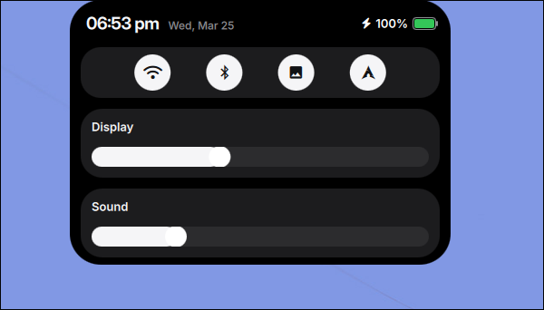

# Tide 
- Tide is a smooth, flexible, and fast interactive island component designed for Hyprland users.

- Based on Quickshell and C++ /Qt 6.

- Pursuting lightweight, smooth anim, and low-latency performance. 
### usage

Memory usage: < 200 Mb (PSS)

CPU usage < 2%

## Description


Video: https://www.youtube.com/watch?v=vCA8sWLJjiw&list=LL&index=2


#### Clock Mode

<div align="left">
  
</div>

#### System Notifications

<div align="left">
  
</div>

####  Workspace Indicator

<div align="left">
  
</div>

#### Lyrics

<div align="left">
  
</div>

#### Control Center

<div align="left">
  
</div>

<div align="left">
  
</div>

####  Music Player
<div align="left">
  
</div>

####  Workspace Overview
<div align="left">
  
</div>

#### Custom Page
<div align="left">
  
</div>

### Items that are supported in Custom Page
- time
- data
- battery
- volume
- brightness
- workspace
- cpu
- ram
- cava

### Control

| Action | Behavior |
|--------|----------|
| Left Click | Open Music Player |
| Right Click | Open Control Center |
| Swipe Left | Show Lyrics |
| Swipe Right | Custom Page |
| Super + Tab | Open Workspace Overview |
| Charging / Discharging | Display battery status icon |
| Brightness Change | Show brightness OSD |
| Volume Change | Show volume OSD |
| Caps Lock Toggle | Show status message |


### Dependencies

#### Build-time Dependencies (Compiling the backend)
- CMake (>= 3.16)

- C++17 Compiler (GCC or Clang)

- Qt6 SDK: Specifically Core, Qml, Network, and DBus modules

- libudev-dev: Required for monitoring battery status via udev

#### Runtime Environment

- Hyprland

- Quickshell

- pactl

- wpctl

- cava

- UPower DBus service and access to /sys/class/power_supply

#### Assets & Scripts

- Any nerd font (for icon) && any font (for text) 

## Getting Start

### Download 
```bash
git clone https://github.com/enhaoswen/Dynamic-Island-on-Hyprland.git && cd Dynamic-Island-on-Hyprland
```

> make sure you change the program if is necessary, check important things at the end.


### Build 

```bash
cmake -S . -B build && cmake --build build -j"$(nproc)" && \
cmake -S ./ConnectivityBackend -B ./ConnectivityBackend/build && \
cmake --build ./ConnectivityBackend/build -j"$(nproc)" && \
mkdir -p ~/.config/quickshell/dynamic_island/{IslandBackend,ConnectivityBackend,bin} && \
cp ./*.qml ~/.config/quickshell/dynamic_island/ && \
cp ./bin/* ~/.config/quickshell/dynamic_island/bin/ && \
cp build/{libIslandBackend.so,libIslandBackendplugin.so,qmldir,IslandBackend.qmltypes} \
~/.config/quickshell/dynamic_island/IslandBackend/ && \
cp ./ConnectivityBackend/{libConnectivityBackendplugin.so,qmldir} \
~/.config/quickshell/dynamic_island/ConnectivityBackend/

```

### Clean 

```bash
cd ../.. && rm -rf Dynamic-Island-on-Hyprland
```

#### To run in Hyprland
```bash
QML2_IMPORT_PATH=~/.config/quickshell/dynamic_island quickshell -p ~/.config/quickshell/dynamic_island/shell.qml
```

### To activate workspace overview
```conf
bind = SUPER, TAB, exec, qs ipc -p ~/.config/quickshell/dynamic_island/shell.qml call overview toggle
```
> It is fine to change super tab to something else

## Acknowledgments

- [@end-4](https://github.com/end-4) - For the workspace overview design.
- [@BEST8OY](https://github.com/BEST8OY) - For providing the lyrics support.
- [@gozhuimeng](https://github.com/gozhuimeng) - For improve the lyrics backend.

## Important thing

- **For custom scripts, please make your own and change the path in UserConfig.qml**

- **The backend is hardcoded to read /sys/class/backlight/intel_backlight/. If you are using AMD or a different backlight driver, please update the path (SysBackend.cpp:353).**

- **The status of caps lock is currently polled via hyprctl devices. Ensure hyprctl is in your $PATH.**

- **To get access, click [here](https://github.com/gozhuimeng/Dynamic-island-on-hyprland).**

- **If you encounter any issues, feel free to open an issue!**
